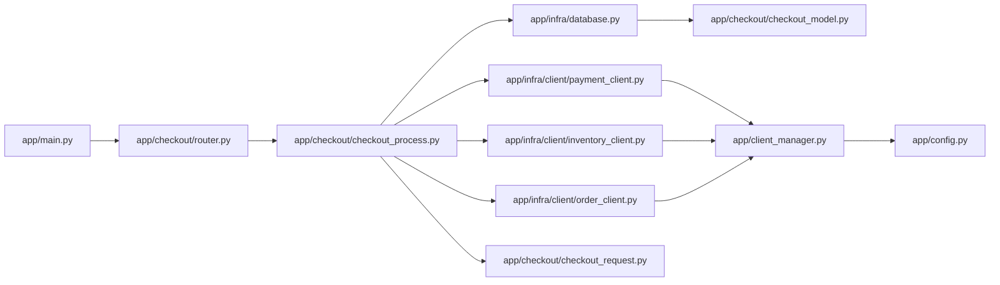
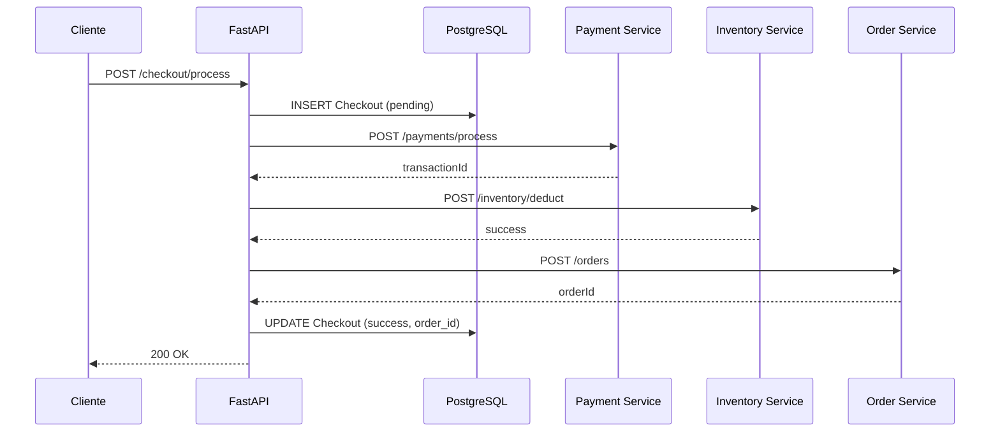
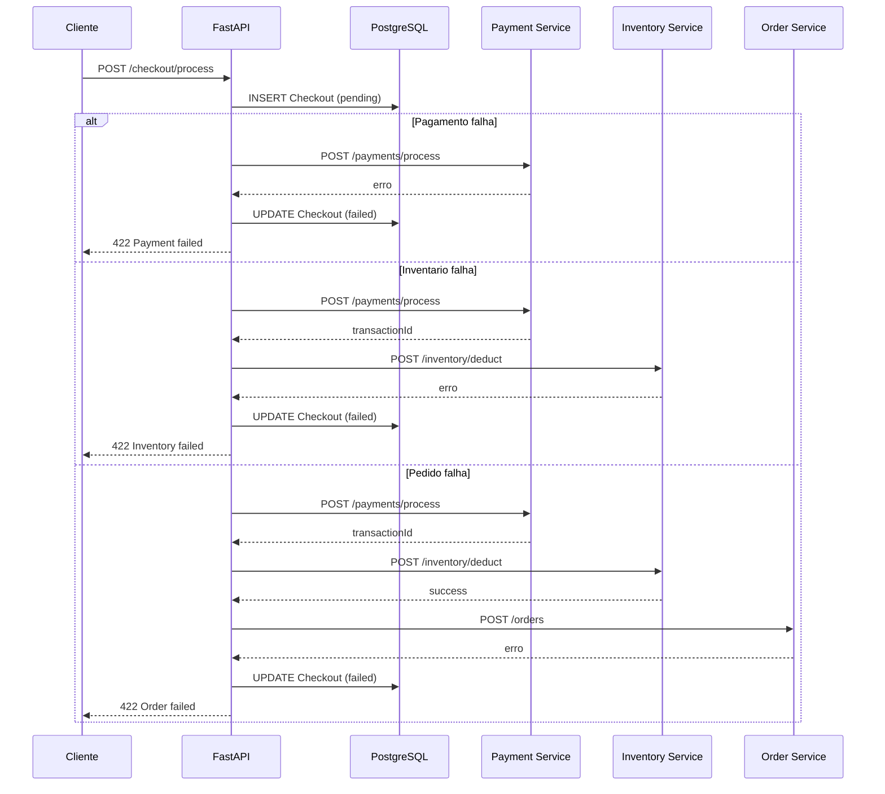

# Service checkout ecommerce

## 1) Visao geral do projeto

**Checkout** e a etapa final do fluxo de compras: e o momento em que o carrinho vira um pedido real. **Este microservico** e o orquestrador dessa etapa, garantindo que pagamento, estoque e criacao do pedido acontecam na ordem certa e com rastreabilidade. **Cliente**, aqui, nao e a pessoa em si, mas o sistema que consome esta API (por exemplo, o frontend do e-commerce, um BFF ou um outro microservico de carrinho) e que envia os dados da compra para o checkout.

Em termos simples: o sistema que controla o carrinho envia os dados para este microservico; ele registra a tentativa de checkout no banco; depois chama os servicos de pagamento, inventario e pedido; por fim responde ao sistema chamador com sucesso ou falha. **O objetivo** e transformar uma intencao de compra em um pedido confirmado, com o menor risco de inconsistencias.

Este projeto implementa um microservico de checkout para e-commerce. Ele recebe um pedido de compra (itens + endereco + metodo de pagamento), calcula o total, salva um registro de checkout no banco, e entao coordena tres integracoes externas:

1) Pagamento (autorizar/capturar pagamento).
2) Inventario (baixar estoque dos itens).
3) Pedido (criar o pedido final).

Se todas as etapas tiverem sucesso, o checkout e marcado como sucesso e o `order_id` e salvo. Se alguma etapa falhar, o checkout e marcado como falha e um erro detalhado e retornado.

## 2) Fluxo por arquivo (com codigo e explicacao curta)

Aqui o fluxo real do request, na ordem em que os arquivos entram em cena. Primeiro o FastAPI recebe, depois o roteador encaminha, em seguida a funcao de checkout orquestra banco e servicos externos.



### app/main.py

```python
from fastapi import FastAPI
from fastapi.concurrency import asynccontextmanager

from app.checkout.router import router as checkout_router
from app.client_manager import client_manager
from app.config import APP_HOST, APP_PORT, PAYMENT_SERVICE_URL
from app.infra.database import create_tables


@asynccontextmanager
async def lifespan(app: FastAPI):
   """Manage application lifespan events"""
   # Startup: Create database tables
   await create_tables()
   await client_manager.startup()
   yield
   await client_manager.shutdown()


app = FastAPI(title="Checkout Commerce", version="0.1.0", lifespan=lifespan)

app.include_router(checkout_router)


@app.get("/health")
async def health_check():
   return {"status": PAYMENT_SERVICE_URL}


if __name__ == "__main__":
   import uvicorn

   uvicorn.run(app, host=APP_HOST, port=APP_PORT)
```

Este arquivo cria a aplicacao e registra o roteador de checkout, entao todo request entra aqui e ja encontra o endpoint certo. No startup, ele cria as tabelas e inicializa os clientes HTTP, garantindo que o fluxo de dados tenha banco e conexoes prontos antes das chamadas externas.

### app/checkout/router.py

```python
from fastapi import APIRouter

from app.checkout.checkout_process import checkout_process

router = APIRouter(prefix="/checkout", tags=["Checkout"])

router.add_api_route(
   "/process",
   endpoint=checkout_process,
   methods=["POST"],
)
```

Aqui o caminho `/checkout/process` e mapeado para a funcao de orquestracao, entao o request sai do app e segue direto para `checkout_process`.

### app/checkout/checkout_process.py

```python
from fastapi import Depends, HTTPException
from sqlalchemy.ext.asyncio import AsyncSession

from app.checkout.checkout_model import Checkout, CheckoutStatus
from app.checkout.checkout_request import CheckoutRequest
from app.infra.client.inventory_client import InventoryClient, get_inventory_client
from app.infra.client.order_client import OrderClient, get_order_client
from app.infra.client.payment_client import PaymentClient, get_payment_client
from app.infra.database import get_db


async def checkout_process(
   checkout_request: CheckoutRequest,
   db: AsyncSession = Depends(get_db),
   payment_client: PaymentClient = Depends(get_payment_client),
   inventory_client: InventoryClient = Depends(get_inventory_client),
   order_client: OrderClient = Depends(get_order_client),
):
   total_amount = float(sum(item.price for item in checkout_request.items))

   checkout = Checkout(
      customer_email=checkout_request.customer_email,
      total_amount=total_amount,
      status=CheckoutStatus.PENDING.value,
   )
   db.add(checkout)
   await db.commit()
   await db.refresh(checkout)

   payment_response = await payment_client.process(
      total_amount=total_amount,
      payment_method=checkout_request.payment_method,
      customer_email=checkout_request.customer_email,
   )
   if payment_response["error"]:
      checkout.status = CheckoutStatus.FAILED.value
      checkout.error = payment_response["error"]
      await db.commit()
      raise HTTPException(
         status_code=422,
         detail={
            "checkout_id": checkout.id,
            "error": "Payment processing failed",
            "message": payment_response["error"],
         },
      )

   checkout.payment_id = payment_response["transaction_id"]

   inventory_response = await inventory_client.deduct(
      items=checkout_request.items,
   )
   if inventory_response["error"]:
      checkout.status = CheckoutStatus.FAILED.value
      checkout.error = inventory_response["error"]
      await db.commit()
      raise HTTPException(
         status_code=422,
         detail={
            "checkout_id": checkout.id,
            "error": "Inventory failed",
            "message": inventory_response["error"],
         },
      )

   order_response = await order_client.create(
      checkout_id=checkout.id,
      customer_email=checkout_request.customer_email,
      shipping_address=checkout_request.shipping_address,
      items=checkout_request.items,
   )
   if order_response["error"]:
      checkout.status = CheckoutStatus.FAILED.value
      checkout.error = order_response["error"]
      await db.commit()
      raise HTTPException(
         status_code=422,
         detail={
            "checkout_id": checkout.id,
            "error": "Order failed",
            "message": order_response["error"],
         },
      )

   checkout.order_id = order_response["order_id"]
   checkout.status = CheckoutStatus.SUCCESS.value
   await db.commit()
   return {"checkout_id": checkout.id, "error": None}
```

Esta funcao e o ponto central do fluxo: recebe os dados validados, grava o checkout no banco, chama pagamento, inventario e pedido, e encerra com sucesso ou erro, sempre atualizando o status no banco.

### app/checkout/checkout_request.py

```python
from typing import List

from pydantic import BaseModel


class PaymentMethodRequest(BaseModel):
   type: str
   card_number: str
   card_expiry: str
   card_cvv: str


class ShippingAddressRequest(BaseModel):
   street: str
   number: str
   city: str
   state: str
   zip_code: str


class ItemRequest(BaseModel):
   product_id: str
   quantity: int
   price: float


class CheckoutRequest(BaseModel):
   payment_method: PaymentMethodRequest
   customer_email: str
   shipping_address: ShippingAddressRequest
   items: List[ItemRequest]
```

Este arquivo define o formato do JSON de entrada, entao antes do fluxo seguir o Pydantic valida e transforma tudo em objetos tipados.

### app/infra/database.py

```python
from sqlalchemy.ext.asyncio import async_sessionmaker, create_async_engine
from sqlalchemy.orm import declarative_base

from app.config import DATABASE_URL

if not DATABASE_URL:
   raise RuntimeError("DATABASE_URL is not set")

engine = create_async_engine(DATABASE_URL, echo=True)

AsyncSessionLocal = async_sessionmaker(engine, expire_on_commit=False)

Base = declarative_base()


async def get_db():
   """Dependency to get database session"""
   async with AsyncSessionLocal() as session:
      try:
         yield session
      finally:
         await session.close()


async def create_tables():
   from app.checkout.checkout_model import (
      Checkout,  # noqa: F401 - Import needed to register model with Base
   )

   """Create all tables in the database based on SQLAlchemy models"""
   async with engine.begin() as conn:
      await conn.run_sync(Base.metadata.create_all)
```

Aqui nasce a conexao com o banco e o `get_db` fornece a session para o fluxo, por isso o checkout consegue salvar e atualizar o status em cada etapa.

### app/checkout/checkout_model.py

```python
from datetime import datetime, timezone
from enum import Enum

from sqlalchemy import DateTime, Float, Integer, String
from sqlalchemy.orm import Mapped, mapped_column

from app.infra.database import Base


class CheckoutStatus(Enum):
   """Enum representing the different states of a checkout process."""

   PENDING = "pending"
   SUCCESS = "success"
   PROCESSING_PAYMENT = "processing_payment"
   PROCESSING_INVENTORY = "processing_inventory"
   CREATING_ORDER = "creating_order"
   FAILED = "failed"


class Checkout(Base):
   """Model representing a checkout process."""

   __tablename__ = "checkouts"

   id: Mapped[int] = mapped_column(Integer, primary_key=True, index=True)
   customer_email: Mapped[str] = mapped_column(String(128), nullable=False)
   order_id: Mapped[str | None] = mapped_column(String(64), nullable=True)
   payment_id: Mapped[str | None] = mapped_column(String(64), nullable=True)
   total_amount: Mapped[float] = mapped_column(Float, nullable=False)
   status: Mapped[str] = mapped_column(
      String, nullable=False, default=CheckoutStatus.PENDING.value
   )
   created_at: Mapped[datetime] = mapped_column(DateTime, default=datetime.now(timezone.utc))
```

Este modelo e a estrutura persistida, entao o fluxo salva aqui o estado do checkout e referencia os ids gerados pelos servicos externos.

### app/client_manager.py

```python
from typing import Optional

import httpx

from app.config import INVENTORY_SERVICE_URL, ORDER_SERVICE_URL, PAYMENT_SERVICE_URL


class ClientManager:
   def __init__(self):
      self._payment_client: Optional[httpx.AsyncClient] = None
      self._inventory_client: Optional[httpx.AsyncClient] = None
      self._order_client: Optional[httpx.AsyncClient] = None

   async def startup(self):
      self._payment_client = httpx.AsyncClient(base_url=PAYMENT_SERVICE_URL, timeout=10.0)
      self._inventory_client = httpx.AsyncClient(base_url=INVENTORY_SERVICE_URL, timeout=30.0)
      self._order_client = httpx.AsyncClient(base_url=ORDER_SERVICE_URL, timeout=15.0)

   async def shutdown(self):
      if self._payment_client:
         await self._payment_client.aclose()
      if self._inventory_client:
         await self._inventory_client.aclose()
      if self._order_client:
         await self._order_client.aclose()

   @property
   def payment_client(self) -> httpx.AsyncClient:
      if not self._payment_client:
         raise RuntimeError("Payment client not initialized")
      return self._payment_client

   @property
   def inventory_client(self) -> httpx.AsyncClient:
      if not self._inventory_client:
         raise RuntimeError("Inventory client not initialized")
      return self._inventory_client

   @property
   def order_client(self) -> httpx.AsyncClient:
      if not self._order_client:
         raise RuntimeError("Order client not initialized")
      return self._order_client


client_manager = ClientManager()
```

Este gerenciador cria e reutiliza conexoes HTTP, entao o fluxo evita abrir clientes novos a cada request e melhora desempenho nas chamadas externas.

### app/infra/client/payment_client.py

```python
import asyncio

import httpx

from app.checkout.checkout_request import PaymentMethodRequest
from app.client_manager import client_manager


class PaymentClient:
   def __init__(self, client: httpx.AsyncClient, max_retries: int = 3):
      self.client = client
      self.max_retries = max_retries

   async def process(
      self,
      total_amount: float,
      payment_method: PaymentMethodRequest,
      customer_email: str,
   ):
      payload = {
         "amount": total_amount,
         "payment_method": {
            "type": payment_method.type,
            "card_number": payment_method.card_number,
            "card_expiry": payment_method.card_expiry,
            "card_cvv": payment_method.card_cvv,
         },
         "customer_email": customer_email,
      }

      last_error = None
      for attempt in range(self.max_retries):
         try:
            response = await self.client.post("/payments/process", json=payload)
            response.raise_for_status()
            transaction_id = response.json()["transactionId"]
            return {"transaction_id": transaction_id, "error": None}
         except httpx.HTTPStatusError as e:
            if 400 <= e.response.status_code < 500:
               # Client error, do not retry
               error_response = e.response.text
               return {"transaction_id": None, "error": error_response}
            last_error = e.response.text
         except (httpx.RequestError, httpx.TimeoutException) as e:
            # Network errors and timeouts - retry
            last_error = str(e)
         except Exception as e:
            return {"transaction_id": None, "error": str(e)}

         # Wait before retrying (exponential backoff)
         if attempt < self.max_retries - 1:
            wait_time = 2**attempt  # 1s, 2s, 4s
            await asyncio.sleep(wait_time)

      return {
         "transaction_id": None,
         "error": f"Payment failed after {self.max_retries} attempts: {last_error}",
      }


def get_payment_client() -> PaymentClient:
   return PaymentClient(client=client_manager.payment_client)
```

Este cliente envia o payload de pagamento e aplica retry com backoff, entao o fluxo lida melhor com instabilidades sem perder o controle do erro final.

### app/infra/client/inventory_client.py

```python
import os

import httpx

from app.checkout.checkout_request import ItemRequest


class InventoryClient:
   def __init__(self):
      self.inventory_service_url = os.getenv("INVENTORY_SERVICE_URL")
      self.client = httpx.AsyncClient(base_url=self.inventory_service_url)

   async def deduct(
      self,
      items: list[ItemRequest],
   ):
      payload = {
         "items": [
            {
               "product_id": item.product_id,
               "quantity": item.quantity,
            }
            for item in items
         ],
      }
      response = await self.client.post("/inventory/deduct", json=payload)
      response.raise_for_status()
      return {"success": True, "error": None}


def get_inventory_client() -> InventoryClient:
   return InventoryClient()
```

Este cliente baixa estoque com base nos itens, entao o fluxo so segue para o pedido quando o inventario confirma a baixa.

### app/infra/client/order_client.py

```python
import os

import httpx

from app.checkout.checkout_request import ItemRequest, ShippingAddressRequest


class OrderClient:
   def __init__(self):
      self.order_service_url = os.getenv("ORDER_SERVICE_URL")
      self.client = httpx.AsyncClient(base_url=self.order_service_url)

   async def create(
      self,
      checkout_id: int | str,
      customer_email: str,
      shipping_address: ShippingAddressRequest,
      items: list[ItemRequest],
   ):
      payload = {
         "checkout_id": str(checkout_id),
         "customer_email": customer_email,
         "shipping_address": {
            "street": shipping_address.street,
            "number": shipping_address.number,
            "city": shipping_address.city,
            "state": shipping_address.state,
            "zip_code": shipping_address.zip_code,
         },
         "items": [
            {
               "product_id": item.product_id,
               "quantity": item.quantity,
            }
            for item in items
         ],
      }
      response = await self.client.post("/orders", json=payload)
      response.raise_for_status()
      transaction_id = response.json().get("orderId")
      return {"order_id": transaction_id, "error": None}


def get_order_client() -> OrderClient:
   return OrderClient()
```

Este cliente cria o pedido final e devolve o `order_id`, entao o fluxo fecha o checkout com status de sucesso.

### app/config.py

```python
import os

from dotenv import load_dotenv

load_dotenv()

APP_HOST = os.getenv("APP_HOST", "0.0.0.0")
APP_PORT = int(os.getenv("APP_PORT", "8005"))

DATABASE_URL = os.getenv("DATABASE_URL", "")
PAYMENT_SERVICE_URL = os.getenv("PAYMENT_SERVICE_URL", "")
INVENTORY_SERVICE_URL = os.getenv("INVENTORY_SERVICE_URL", "")
ORDER_SERVICE_URL = os.getenv("ORDER_SERVICE_URL", "")
```

Este arquivo define as URLs e configuracoes usadas por todos os outros arquivos, entao o fluxo sempre depende dele para saber onde estao banco e servicos externos.

## 3) Ciclo de vida da aplicacao

O ciclo de vida e controlado pela funcao `lifespan` do FastAPI:

1) Startup:
   - Cria tabelas no banco (create_tables).
   - Inicializa clientes HTTP (client_manager.startup).
2) Shutdown:
   - Fecha clientes HTTP (client_manager.shutdown).

Isso garante que os clientes e o banco estejam prontos antes das rotas atenderem requisicoes.

## 4) Fluxo principal: /checkout/process

### 4.1 Entrada e saida (exemplos JSON estilo doc de API)

**Request** `POST /checkout/process`

```json
{
   "payment_method": {
      "type": "credit_card",
      "card_number": "4111111111111111",
      "card_expiry": "12/25",
      "card_cvv": "123"
   },
   "customer_email": "customer@example.com",
   "shipping_address": {
      "street": "Rua das Flores",
      "number": "123",
      "city": "Sao Paulo",
      "state": "SP",
      "zip_code": "01234-567"
   },
   "items": [
      {
         "product_id": "prod_001",
         "quantity": 2,
         "price": 99.90
      },
      {
         "product_id": "prod_002",
         "quantity": 1,
         "price": 149.90
      }
   ]
}
```

**Response (sucesso)** `200 OK`

```json
{
   "checkout_id": 101,
   "error": null
}
```

**Response (falha de pagamento)** `422 Unprocessable Entity`

```json
{
   "detail": {
      "checkout_id": 101,
      "error": "Payment processing failed",
      "message": "cartao recusado"
   }
}
```

Schema definido em app/checkout/checkout_request.py

### 4.2 Fluxo de dados (A > B > C)

Fluxo simplificado:

Cliente HTTP
  > API FastAPI (/checkout/process)
  > Validacao Pydantic (CheckoutRequest)
  > Persistencia inicial no banco (Checkout PENDING)
  > Pagamento externo
  > Inventario externo
  > Pedido externo
  > Persistencia final (Checkout SUCCESS + order_id)
  > Resposta ao cliente

### 4.3 Fluxo detalhado passo a passo

1) Recebe a requisicao no endpoint `/checkout/process`.
2) O Pydantic valida e transforma o JSON em um objeto `CheckoutRequest`.
3) Calcula o total:
   - Soma apenas o campo `price` dos itens (nota: nao multiplica por `quantity`).
4) Cria o registro `Checkout` no banco com status `pending`.
5) Chama o servico de pagamento:
   - Envia `amount`, `payment_method` e `customer_email`.
   - Se falhar (HTTP 4xx), nao tenta novamente.
   - Se falhar (HTTP 5xx ou timeout), tenta novamente com backoff.
6) Se pagamento falhar:
   - Atualiza status para `failed`.
   - Salva o erro no banco.
   - Retorna HTTP 422 com detalhes.
7) Se pagamento ok:
   - Salva `payment_id` no checkout.
8) Chama o inventario para baixar estoque:
   - Envia lista de itens com `product_id` e `quantity`.
9) Se inventario falhar:
   - Atualiza status para `failed`.
   - Salva erro no banco.
   - Retorna HTTP 422.
10) Se inventario ok:
    - Chama o servico de pedidos.
11) Se pedido falhar:
    - Atualiza status para `failed`.
    - Salva erro no banco.
    - Retorna HTTP 422.
12) Se pedido ok:
    - Salva `order_id`.
    - Atualiza status para `success`.
    - Retorna sucesso ao cliente.

## 5) Diagramas de sequencia (fluxos separados)

### 5.1 Happy flow (sucesso ponta a ponta)



### 5.2 Fluxos de falha (pagamento, inventario, pedido)



## 6) Detalhes do banco de dados

### 6.1 Tabela `checkouts`
Tabela em formato tabular (estilo planilha):

| coluna         | tipo            | nulo | descricao |
|----------------|-----------------|------|-----------|
| id             | integer         | nao  | chave primaria |
| customer_email | varchar(128)    | nao  | email do cliente |
| order_id       | varchar(64)     | sim  | id do pedido (servico de pedidos) |
| payment_id     | varchar(64)     | sim  | id da transacao (servico de pagamento) |
| total_amount   | float           | nao  | total calculado |
| status         | varchar         | nao  | estado do checkout |
| created_at     | datetime        | nao  | data/hora da criacao |

Representacao em JSON (exemplo de um registro):

```json
{
  "id": 101,
  "customer_email": "customer@example.com",
  "order_id": "ORD-2026-0001",
  "payment_id": "PAY-9d3a",
  "total_amount": 349.70,
  "status": "success",
  "created_at": "2026-05-20T10:11:12Z"
}
```

Definido em app/checkout/checkout_model.py

### 6.2 Criacao de tabelas
- A funcao `create_tables()` roda no startup e cria as tabelas se nao existirem.
- Isso usa `Base.metadata.create_all`.

## 7) Clientes HTTP e integracoes externas

### 7.1 PaymentClient
- Envia dados do pagamento para `/payments/process`.
- Implementa retry (max 3):
  - 4xx: nao tenta de novo.
  - 5xx, timeout ou erro de rede: tenta novamente com backoff (1s, 2s, 4s).
- Se sucesso, retorna `transaction_id`.

Arquivo: app/infra/client/payment_client.py

### 7.2 InventoryClient
- Envia itens para `/inventory/deduct`.
- Se sucesso, retorna `success = True`.
- Se falhar, levanta erro (raise_for_status) e a excecao sobe.

Arquivo: app/infra/client/inventory_client.py

### 7.3 OrderClient
- Envia dados de envio e itens para `/orders`.
- Se sucesso, retorna `order_id`.
- Se falhar, levanta erro (raise_for_status) e a excecao sobe.

Arquivo: app/infra/client/order_client.py

### 7.4 ClientManager
- Centraliza os `httpx.AsyncClient` para evitar recriacao a cada requisicao.
- Os clientes sao criados no startup e fechados no shutdown.

Arquivo: app/client_manager.py

## 8) Configuracoes e variaveis de ambiente

As URLs e configuracoes principais sao lidas via `.env`:

- `APP_HOST` e `APP_PORT`
- `DATABASE_URL`
- `PAYMENT_SERVICE_URL`
- `INVENTORY_SERVICE_URL`
- `ORDER_SERVICE_URL`

Arquivo: app/config.py

## 9) Mocks com WireMock

Os servicos externos sao simulados pelo WireMock em desenvolvimento:

- Payment mock: porta 8081
- Inventory mock: porta 8082
- Order mock: porta 8083

Os mapeamentos de resposta estao em `wiremock/`.

## 10) Execucao local (resumo)

1) Subir infraestrutura:
   - `docker-compose up -d`
2) Criar e ativar venv + instalar deps:
   - `uv venv` e `uv sync`
3) Executar FastAPI:
   - `python -m uvicorn app.main:app --reload`

## 11) Pontos de atencao e observacoes tecnicas

- O calculo do total usa apenas `item.price` e nao multiplica por `quantity`. Se o preco for por unidade, pode haver sub-calculo.
- `InventoryClient` e `OrderClient` criam `AsyncClient` por instancia; isso pode abrir muitos sockets se instanciados frequentemente.
- `payment_client` usa `client_manager`, mas os outros nao usam. Isso gera inconsistencias na reutilizacao de conexoes.
- `CheckoutStatus` define estados intermediarios (PROCESSING_PAYMENT, etc.) que nao sao utilizados no fluxo atual.

## 12) Fluxos de dados (versao textual A > B > C)

### 12.1 Fluxo completo de checkout

Requisicao HTTP
  > FastAPI (router)
  > CheckoutRequest (Pydantic)
  > CheckoutProcess (orquestracao)
  > Database (cria checkout)
  > Payment Service
  > Inventory Service
  > Order Service
  > Database (atualiza checkout)
  > Resposta HTTP

### 12.2 Fluxo de falha no pagamento

Requisicao HTTP
  > FastAPI
  > Database (checkout pendente)
  > Payment Service (falha)
  > Database (checkout failed + erro)
  > HTTP 422

### 12.3 Fluxo de falha no inventario

Requisicao HTTP
  > FastAPI
  > Database (checkout pendente)
  > Payment Service (ok)
  > Inventory Service (falha)
  > Database (checkout failed + erro)
  > HTTP 422

### 12.4 Fluxo de falha no pedido

Requisicao HTTP
  > FastAPI
  > Database (checkout pendente)
  > Payment Service (ok)
  > Inventory Service (ok)
  > Order Service (falha)
  > Database (checkout failed + erro)
  > HTTP 422

## 13) Onde olhar no codigo (mapa rapido)

- Entrada da aplicacao: app/main.py
- Endpoint de checkout: app/checkout/router.py
- Logica principal: app/checkout/checkout_process.py
- Modelos do banco: app/checkout/checkout_model.py
- Schemas de entrada: app/checkout/checkout_request.py
- Banco (SQLAlchemy async): app/infra/database.py
- Integracoes externas: app/infra/client/*.py
- Variaveis de ambiente: app/config.py
- Mocks e mappings: wiremock/
